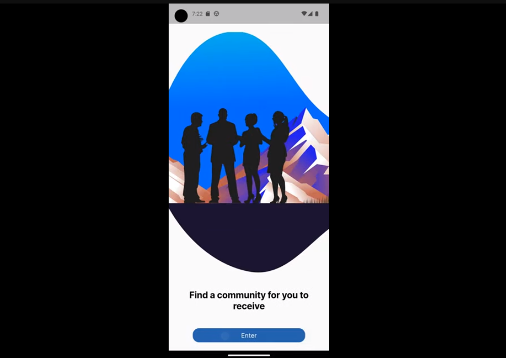

## Samba Meets Waltz. A Hackathon Connecting Brazil & Austria.

<div align="center">
    
</div>

---

# EmployEd: Connecting Circuits to Careers 🇦🇹🇧🇷

> _TEAM 263: Samba Meets Waltz


---

## 🌐 Introduction

Welcome to EmployEd's Intelligent Recruitment Platform, specially designed to expedite the hiring process by empowering talents and connecting industries with universities. Our innovative approach focuses on international recruitment, skill development, and fostering collaboration between companies and higher education institutions.

### 📹 App Preview 

[](https://www.youtube.com/shorts/JuuGVvMb2jA)

<details>
<summary>🌟 Features</summary>

### 🔹 Automatic Europass Resume Converter
Automatically convert your resumes into the Europass format through integration with platforms like LinkedIn.

### 🔹 Skill Compatibility Analyzer
Evaluate your skills against available job openings and receive a report on areas for improvement.

### 🔹 Training Trails for Different Levels
Free training modules to boost your language skills and give you a competitive edge in the job market.

</details>

---

## 🛠 Installation (Mobile)

1. **Pre-requisites**
    - Make sure you have Dart and Flutter installed on your machine.

2. **Clone the Repository**

    ```bash
    git clone https://github.com/bellujrb/hackathon-austria
    ```

3. **Install Dependencies**

    ```bash
    flutter pub get
    ```

4. **Run the App**

    ```bash
    flutter run
    ```

---

## 🔄 Workflow

<details>
<summary>📋 Activity Flowchart</summary>

The system features integrate into a workflow that allows companies to forecast growth and actively participate in talent formation. 

1. **User Registration**
    - Both talents and companies register on the platform.
  
2. **Europass Resume Creation**
    - Import resumes from platforms like LinkedIn.
  
3. **Skill Compatibility Analysis**
    - Use the Skill Compatibility Analyzer for skill assessment.
  
4. **Training and Improvement**
    - Access Training Trails to enhance skills.
  
5. **Company Collaboration**
    - Companies can search for talents based on specific needs.

</details>

---

## 📂 Project File Tree

```
EmployEd
├── android
│   └── ...
├── assets
│   └── welcome1.png
├── ios
│   └── ...
├── lib
│   ├── app_module.dart
│   ├── core
│   │   └── ...
│   ├── main.dart
│   └── module
│       ├── home
│       │   └── ...
│       └── welcome
│           └── ...
├── linux
│   └── ...
├── macos
│   └── ...
├── pubspec.lock
├── pubspec.yaml
├── README.md
├── test
│   └── widget_test.dart
├── web
│   └── ...
└── windows
    └── ...
```

---

## 🧪 Testing Plan

Flutter's unit testing framework allows for quick and reliable testing. Below is a unitary testing plan based on the file structure and Flutter.

### `lib/`

#### `module/home`

- `home_module.dart`
    - Test if the module initializes correctly.
- `infra/models/home_model.dart`
    - Test JSON serialization and deserialization.
- `infra/services/home_service.dart`
    - Test API interactions for expected outcomes.
- `presenter/screens/home/home_screen.dart`
    - Test UI rendering and interactions.
  
#### `module/welcome`

- `welcome_module.dart`
    - Test if the module initializes correctly.
- `infra/models/welcome_model.dart`
    - Test JSON serialization and deserialization.
- `infra/services/welcome_service.dart`
    - Test API interactions for expected outcomes.
- `presenter/screens/welcome/welcome_screen.dart`
    - Test UI rendering and interactions.

#### `core/`

- `core/extensions/build_context_utils.dart`
    - Test context extension methods.
- `core/styles/colors.dart` & `core/styles/text_styles.dart`
    - Visual tests (Manual).

### `test/`

- `widget_test.dart`
    - Write widget tests for major interactive UI components.

To run tests, you can use the following command in your terminal:

```bash
flutter test
```

For more in-depth testing, you can also run integration tests to simulate user interactions across multiple screens.

---

## 💎 Platform Unique Selling Points

1. **Focus on SDG 17**
    - Aligned with Sustainable Development Goal 17 for global cooperation.

2. **Untapped Market Exploration**
    - Focuses on providing opportunities in unexplored markets.

3. **Free Training**
    - Offers free training to enhance linguistic and technical skills.

---

## 🛡 Data Security & Privacy

- All data is rigorously processed and anonymized to ensure privacy.
- Advanced security measures protect against unauthorized access.

---

## 🛠 Tech Stack

### Design Patterns (Mobile)
- Singleton

### External Packages (Mobile)
- Flutter Modular
- Flutter Dotenv
- Google Fonts
- HTTP
- Logger

### Architecture (Mobile)
- Clean Dart

---

## 🌈 Future Roadmap

We plan to expand our software to be cross-platform, aiming to reach a broader audience. International releases are also in the pipeline to attract more talents to Austria.

---

## 🙏 Acknowledgments

Special thanks to Hackathon Brasil and Advantage Austria for this ambitious opportunity.

---
